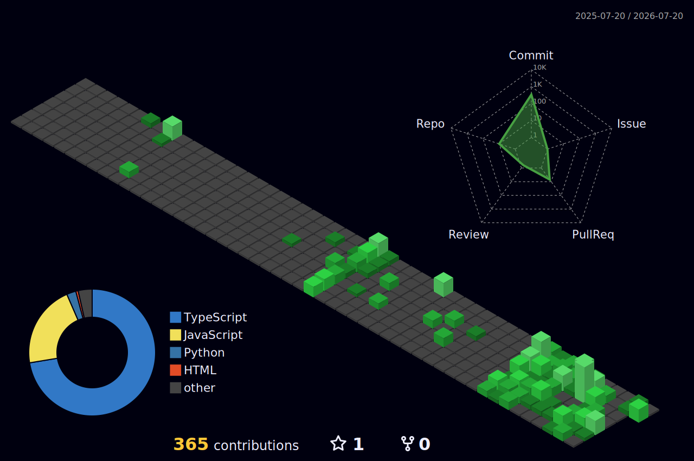

<h1 align="center">Deekshith Goud</h1>

  <kbd>Student</kbd> • <kbd>Systems Thinker</kbd> • <kbd>Builder</kbd>

  <i>I'm a student who builds to explore. Something bothers me or a question won't let go — I research until it clicks, then build fast to see if it holds. The building is how I learn; the learning is why I keep building.</i>

  
  
  

 

## Stack

  <table width="800">
    <tr>
      <td align="center">
         
        <b>Frontend</b>
        

          &nbsp;&nbsp;
          &nbsp;&nbsp;
          &nbsp;&nbsp;
          &nbsp;&nbsp;
          &nbsp;&nbsp;
          
        

         
        <b>Backend & Database</b>
        

          &nbsp;&nbsp;
          &nbsp;&nbsp;
          &nbsp;&nbsp;
          &nbsp;&nbsp;
          
        

         
        <b>Tools & Build</b>
        

          &nbsp;&nbsp;
          &nbsp;&nbsp;
          &nbsp;&nbsp;
          &nbsp;&nbsp;
          &nbsp;&nbsp;
          &nbsp;&nbsp;
          &nbsp;&nbsp;
          
        

         
      </td>
    </tr>
  </table>

 

## Project

**[Local Browse Insights — Privacy-First Web Analytics Extension](https://github.com/Deekshith-goud/local-web-analytics-extension)**  
A production-grade Chrome extension that tracks your browsing habits entirely on-device — no servers, no telemetry, zero external connections. Built with a productivity classifier, interactive dashboards, and a multi-step data purge. The whole idea: your history stays yours.  
`TypeScript` `React` `Plasmo` `Dexie / IndexedDB` `Manifest V3`

 

## Outside the editor
 
- **Chess** — every game is a systems problem with incomplete information and a ticking clock
- **Formula 1** — strategy, engineering tradeoffs, and real-time decisions colliding at 300 km/h
- **Space** — launches, missions, and the occasional existential scale check
- **Tech** — keeping a tab open on what's new, not to stay current, just out of genuine curiosity

 

## Stats

  

  <picture>
    <source media="(prefers-color-scheme: dark)" srcset="./profile-3d-contrib/profile-night-green.svg">
    <source media="(prefers-color-scheme: light)" srcset="./profile-3d-contrib/profile-green.svg">
    
  </picture>

 

  <i>"The mind must be trained to endure the chaos of conflict and the calm of strategy."</i> 
  — Robert Greene

  

